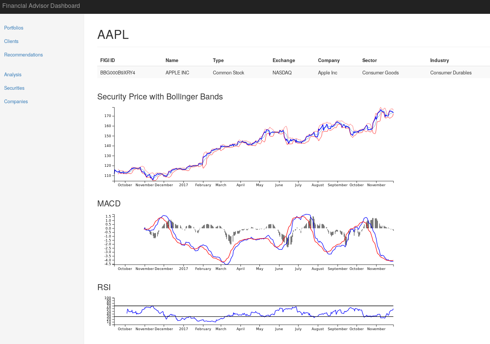
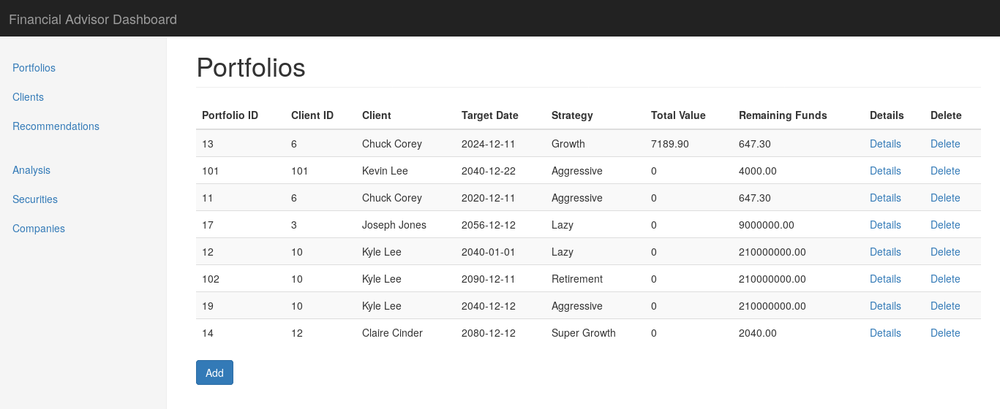

# Financial Advisor Application





## Overview
The repository has the following directories (with technologies listed):

- `financial-advisor` : financial advisor web application
  - Node.js + Express + Pug
- `rest-api` : REST API that the web app uses to retrieve data
  - Node.js + Express
- `intrinio` : scripts to retrieve data for database
  - Python
- `sql` : SQL scripts to initialize database
  - PostgreSQL

## Setup Guide

1. Start the PostgreSQL server and create the database to store security data.
2. Initialize the database with commands in `sql/init.sql`
3. Download and store data form Intrinio using the scripts in `intrinio` directory.
4. Setup and start the REST API server.
5. Setup and start the web application server.

More details can be found in each section.

## Intrinio Tools
The Intrinio tools are helpful to retrieve data from the Intrinio API. Note that this may be deprecated if Intrinio updates their APIs without backwards compatibility.

In order to use the tools, sign up for a free developer account at intrinio https://intrinio.com/signup. Copy down the access username and key.

Setup:
1. `cd` into the `intrinio` directory.
2. Install the dependencies with `pip install requirements.txt` in the root project directory.
3. Rename the `postgres_config.jsontemp` to `postgres_config.json`, and modify the json contents to your specific PostgreSQL server.
4. Rename `intrinio_credentials.jsontemp` to `intrinio_credentials.json` and fill in the Intrinio API key details.
5. Execute the scripts in `tools` directory to populate the database.
  - `tools/company_database_insert.py` : load company data.
  - `tools/security_database_insert.py` : load security data.
  - `tools/security_price_insert.py` : load security price data. Note that the number of pages to get from the Intrinio API is capped (this can be changed in the Python script), since the free developer account has a limited number of API calls per day.
  - `tools/ticker_to_id_mapper.py` : create a mapping file from ticker symbol to FIGI ID. There is already an existing one generated from the data in the `data` directory.


## REST API
The REST API exposes the database as easy to use web endpoints, returning json objects. The REST API itself accesses the database using raw PostgreSQL queries.

Setup:
1. `cd` into the `rest-api` sub directory.
2. Create a `.env` file with the following:
  ```
  PGHOST='localhost'
  PGUSER=postgres
  PGDATABASE=financial_advisor
  PGPASSWORD=postgres
  PGPORT=5432
  ```
  This file is used by the `dotenv` library to load custom environment variables. The variables are used to access the PostgreSQL server and database instance.
  Customize the variables for your specific server.
3. Install node modules with `npm install`.
4. Start the server with `npm run devstart`.
5. Visit http://localhost:3001/securities to check if the server is running.

## Financial Advisor Web Application
The financial advisor web application is a GUI interface to manage securities, clients, portfolios, and more.

Setup:
1. `cd` into the `financial-advisor` sub directory.
2. Create a `.env` file with the following:
  ```
  REST_HOST='MY_REST_SERVER
  ```
  Replace `MY_REST_SERVER` with your custom server address for the REST API. By default, it is set to `http://localhost:3001`.
  
  This file is used by the `dotenv` library to load custom environment variables.

3. Install node modules with `npm install`.
4. Start the server with `npm run devstart`.
5. Visit http://localhost:3000 to view the web application.


